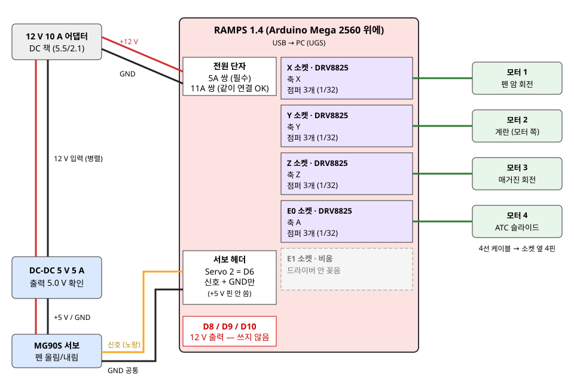

# 배선도

[구매 리스트](부품-목록.md)의 부품 기준입니다. 모터는 5개입니다 (계란 양쪽에 1개씩).

## 1. 전원

| 어디서 | 어디로 | 선 |
|---|---|---|
| 12 V 10 A 어댑터 | DC 잭 케이블 (5.5/2.1) | 꽂기만 |
| DC 잭 + / − | RAMPS 전원 단자 **5A 쌍** + / − | 빨강 / 검정. 11A 쌍은 D8 히터용이라 안 써도 되지만 같이 연결해도 됨 |
| DC 잭 + / − | DC-DC 입력 IN+ / IN− | RAMPS와 나란히(병렬) |
| DC-DC 출력 OUT+ / OUT− | 서보 빨강(+) / 갈색·검정(−) | **서보를 꽂기 전에 멀티미터로 5.0 V 확인** |

- 보드의 5A / 11A 글씨를 꼭 보고 연결합니다. 11A 쌍만 연결하면 모터가 안 돕니다.
- + / − 를 바꿔 꽂으면 보드가 탑니다. 처음 켤 때는 모터와 서보를 빼고 전원만 넣어 LED를 확인합니다.

## 2. 서보 (펜 올림/내림)

| 서보 선 | 연결 |
|---|---|
| 노랑(신호) | RAMPS 서보 헤더 **Servo 2 = D6** 의 신호 핀 |
| 빨강(+5 V) | DC-DC OUT+ (서보 헤더의 +5 V 핀에는 꽂지 않음) |
| 갈색·검정(GND) | DC-DC OUT− **그리고** 서보 헤더 GND 핀 (GND 공통) |

- 펌웨어 `config.h`에서 `SPINDLE_PWM_ON_D8`을 끄고 `SPINDLE_PWM_ON_D6`을 켜서 빌드합니다.
- 파란 단자 D8 / D9 / D10은 12 V 출력입니다. 서보 신호선을 꽂으면 서보가 탑니다.
- 점퍼 케이블(암-수, 암-암)로 연결하고, GND를 여러 갈래로 나눌 때는 브레드보드를 씁니다.

## 3. 스텝모터

| RAMPS 소켓 | 펌웨어 축 | G-code | 모터 | 하는 일 |
|---|---|---|---|---|
| X | 1 | X (도) | 모터 1 | 펜 암 좌우 회전 |
| Y | 2 | Y (도) | 모터 2 | 계란 회전 (모터 쪽) |
| Z | 3 | Z (도) | 모터 3 | 매거진 회전 |
| E0 | 4 | A (mm) | 모터 4 | ATC 슬라이드 |
| E1 | 5 | Y와 같이 움직임 | 모터 5 | 계란 회전 (반대쪽) |

- **모터 5는 Y 복제**입니다. 펌웨어 `config.h`에서 `#define AXIS_5_NAME 'Y'`로 바꾸면 E1 소켓 모터가 Y 명령을 똑같이 따라 합니다. G-code는 바꿀 필요가 없습니다.
- 두 계란 모터는 서로 마주 보고 있어서, 같은 방향 명령이면 계란을 서로 반대로 비틀 수 있습니다. 첫 시운전은 **계란 없이** 두 축이 같은 방향으로 도는지 봅니다. 반대로 돌면 `$3`에 16을 더하거나 모터 5 케이블 한쪽 코일(2선)을 뒤집습니다.
- 모터 케이블 4선은 각 소켓 옆 4핀 헤더에 꽂습니다. 돌지 않고 떨기만 하면 코일 짝이 틀린 것입니다.
- 모터 케이블에 축 이름 라벨을 붙여 둡니다.

## 4. DRV8825 드라이버

- **점퍼**: 소켓마다 아래 점퍼 3개(M0·M1·M2)를 **모두** 꽂으면 1/32 분할 → `machine.toml`의 `microsteps = 32`와 맞습니다.
- **방향**: 드라이버의 EN 핀을 보드 글씨 EN에 맞춰 꽂습니다. 거꾸로 꽂고 전원을 넣으면 드라이버가 탑니다.
- **전류**: 가변저항으로 맞춥니다. DRV8825는 전류 = Vref × 2 입니다. 모터 정격 전류(판매 페이지 확인)의 70 % 정도에서 시작합니다. 예: 1.5 A 모터면 Vref ≈ 0.5 V.
- 방열판을 붙이고, 전원이 켜진 상태에서 드라이버나 모터 선을 뽑지 않습니다.
- 5번째 소켓용 DRV8825 1개를 더 사야 합니다 ([부품 목록](부품-목록.md) 3장).
